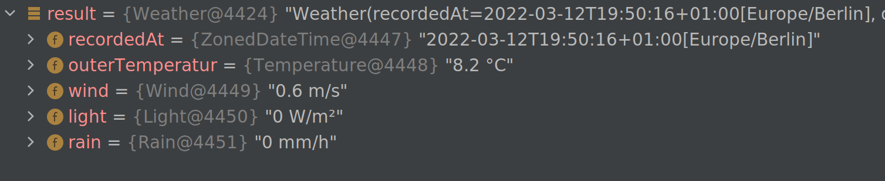

# Java-Library to fetch Weathercloud.net data

Small and simple. Just include the lib via Maven/Gradle

### maven

```xml

<dependency>
    <groupId>ch.akop</groupId>
    <artifactId>weathercloud</artifactId>
    <version>0.0.3</version>
</dependency> 
```

### gradle

```groovy
implementation ch.akop:weathercloud:0.0.3 
```

## Usage

```java
var response=new Scraper().scrape("7003523537");
```


